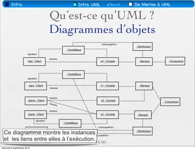
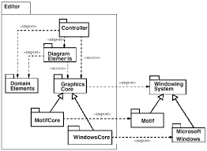
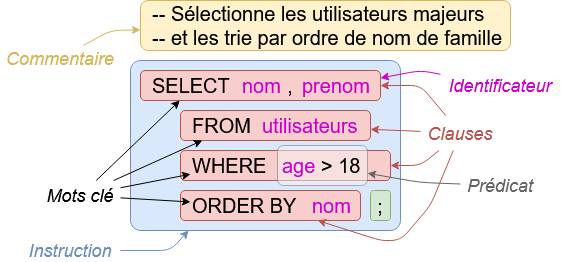

## A. Donnez et expliquez les critères de mesure de qualité des données.
(
    Que ce soit pour mettre sur pied une stratégie commerciale, un projet marketing ou pour entretenir une relation client, vous ne pouvez faire l’un ou l’autre sans disposer de données de qualité. Bien que de nombreuses entreprises tardent encore à investir là-dessus, il est indéniable que disposer des données de qualité confère un avantage concurrentiel sans précédent. Dans la suite de cet article, vous découvrirez les enjeux de la Data Quality pour les entreprises. 

    Plan de l'article

    La qualité des données : un enjeu pour les entreprises
    Définition de la Data Quality
    L'importance de la Data Quality
    Quels sont les indicateurs de qualité de données ?
    Pourquoi faire de la Data Quality ?
    Comment vérifier la qualité des données ?
    Comment mettre en place une stratégie Data Quality ?
    La qualité des données : un enjeu pour les entreprises
    Disposez de données de qualité aujourd’hui est d’un grand intérêt pour les entreprises. Pour mieux appréhender l’importance de la Data Quality, il est primordial de comprendre ce que c'est concrètement.

    A lire aussi : Pour quel type de coque opter pour son smartphone ?

    Définition de la Data Quality
    Pour leur stratégie décisionnelle, les entreprises courent après les données. Toutefois, les entreprises se doivent de récolter celles qui sont de bonnes qualités. Une donnée de qualité est une donnée qui répond aux caractéristiques suivantes : fiable, exacte, exhaustive, valide, disponible et cohérente. Si vous disposez de données répondant à ces critères, alors sachez qu’elles sont de qualité et qu'elles vous permettront d’atteindre les objectifs que vous visez.

    L'importance de la Data Quality
    La technologie et les techniques de gestion des données ne cessent de s’améliorer. C’est ainsi que les données deviennent également de plus en plus précieuses pour les entreprises. Il est désormais difficile pour ces dernières de prendre des décisions qui peuvent impacter leur stratégie marketing, le développement de leur produit ou même leur finance sans utiliser les données.

    A lire en complément : Guide pratique pour mettre en place un Modern Workplace

    Néanmoins, pour jouer sur ce terrain ou pour que les données vous soient utiles, il faut qu’elles soient de qualité. En effet, si elles sont erronées, elles risquent de vous faire prendre des décisions qui impacteront de façon négative l’avenir de votre entreprise. Ceci dit, vous devez être en mesure de détecter les données de mauvaise qualité. 

    Quels sont les indicateurs de qualité de données ?
    
    Comme nous l’avons énoncé dans un précédent paragraphe, les données de qualité doivent être exactes, fiables, pertinentes, exhaustives et actualisées. 

    L’exactitude des données suppose que l'information donnée doit refléter une situation réelle. Elle est l’une des caractéristiques la plus cruciale de la qualité des données. En effet, disposer d’une information inexacte peut être désastreux pour toutes les décisions prises pour l’entreprise.

    Une donnée fiable est une donnée qui ne doit pas contredire une autre information dans une source ou un autre système différent. Cette caractéristique est vitale pour la qualité des données. En effet, lorsque les informations se contredisent, il est difficile de faire confiance aux données.

    La pertinence des données fait allusion au fait qu’une information doit être récoltée pour une raison précise. Ainsi, vous devez bien réfléchir avant de récolter une donnée et non le faire pour le plaisir. Si vous le faites sans avoir d’objectif précis pour cette information, vous perdrez énormément de temps et d’argent. 

    La complétude ou l’exhaustivité des données suppose que ces derniers doivent disposer de toutes les informations nécessaires pour leur exploitation. En effet, si une donnée ne dispose pas de toutes les informations requises pour son exploitation, elle n'est d’aucune utilité. Supposons que vous êtes une entreprise de logistique qui fait dans l’envoi des courriers et colis. Si par exemple, vous devez remettre un colis à un client dont le destinataire ne vous a pas laissé l’adresse de son domicile, que feriez-vous ? Vous voyez qu’il serait difficile de le faire, parce que vous ne disposez pas de cette information.

    Pour qu’une donnée soit utilisée, elle doit être actualisée. Ainsi, une donnée erronée ne serait d’aucune utilité. Effectivement, il est certain que l’information utilisée sera erronée et non adaptée au contexte du moment. 

    Pourquoi faire de la Data Quality ?
    Outre le fait qu’utiliser des données de qualité se révèle être crucial pour vous imposer face à la concurrence et tirer pleinement parti des opportunités du marché, disposer des données de qualité peut également vous faire bénéficier de nombreux avantages. Parmi ces derniers, les plus importants sont :

    Les avantages concurrentiels;

    Une facilité dans la mise en œuvre des données;

    Une rentabilité accrue de l’entreprise;

    Un meilleur ciblage des prospects;

    Une prise de décision plus éclairée;

    Améliorer le cadre des échanges avec les clients;

    Permettre de lancer des campagnes marketing plus efficaces.

    Comment vérifier la qualité des données ?
    Nous avons dans une précédente partie défini les différents critères qui permettent de déterminer les qualités d’une donnée. Toutefois, comment faire pour savoir qu’une donnée répond à ces critères. Pour cela, on doit suivre un cheminement bien précis pour tester la qualité de ladite donnée :

    Il faut commencer par mesurer les métriques précises de la qualité de ladite donnée. Les métriques permettent de comprendre les données ciblées et comment elles doivent être améliorées ;

    Faire un test pour trouver une base de données de référence ;

    Essayez les solutions qui vous permettront d’améliorer la qualité de vos données ;

    Évaluer les résultats obtenus à partir des solutions testées ;

    Comment mettre en place une stratégie Data Quality ?
    L’objectif de la mise en place d’une stratégie de Data Quality est de s’assurer que l’entreprise dispose de données dont elle peut se servir pour atteindre ses objectifs. La mise en place de la stratégie de qualité des données ne déroge pas à la règle générale d’élaboration de stratégies pour un projet. Ainsi, elle doit être définie comme suit :

    S’aligner dans la vision et les missions de l’entreprise;

    Intégrer la stratégie globale de l’entreprise;

    Prendre en compte l’état actuel des données afin d’établir ce qu’il y a lieu de faire;

    Définir les stratégies à appliquer pour atteindre les objectifs fixés;

    Répartir les responsabilités entre les différents membres de l’équipe participant au projet;

    Définir les critères à utiliser pour la prise de décision;

    Communiquer ses apports.

    Pour vous conseiller et vous accompagner dans cette démarche, des consultants experts en Data peuvent intervenir au sein de votre entreprise. Pour ça, il vous suffit de faire appel à une ESN spécialisée dans la data.
)

## B. Donnez une définition et des exemples de systèmes de gestion de bases de données avec des illustrations.
(
    Un système de gestion de base de données (SGBD) est le logiciel qui permet à un ordinateur de stocker, récupérer, ajouter, supprimer et modifier des données. Un SGBD gère tous les aspects primaires d'une base de données, y compris la gestion de la manipulation des données, comme l'authentification des utilisateurs, ainsi que l'insertion ou l'extraction des données. Un SGBD définit ce qu'on appelle le schéma de données ou la structure dans laquelle les données sont stockées.

    Les outils que nous utilisons tous au quotidien nécessitent des SGBD en coulisse. Cela comprend les guichets automatiques bancaires, les systèmes de réservation de vols, les systèmes d'inventaire au détail et les catalogues de bibliothèques, par exemple.

    Pourquoi utiliser système de gestion de base de données ?
    Le SGBD gère trois choses importantes : les données, le moteur de base de données qui permet d'accéder aux données, de les verrouiller et de les modifier, et le schéma de base de données, qui définit la structure logique de la base de données. Ces trois éléments fondamentaux contribuent à assurer la concomitance, la sécurité, l'intégrité des données et l'uniformité des procédures administratives.

    Les tâches typiques d'administration de base de données prises en charge par le SGBD comprennent la gestion des changements, la surveillance/réglage des performances et la sauvegarde et la restauration. De nombreux systèmes de gestion de bases de données sont également responsables de la récupération, du redémarrage et de la récupération automatisée, ainsi que de l'enregistrement et de la vérification des activités.

    Sécurisation et simplification
    Le SGBD est très utile pour fournir une vue centralisée des données et cela pour plusieurs utilisateurs, à partir de plusieurs endroits, d'une manière contrôlée. Un SGBD peut limiter les données que l'utilisateur final voit, ainsi que la façon dont il peut les visualiser, en fournissant plusieurs vues d'un même schéma de base de données. Les utilisateurs finaux et les logiciels n'ont pas à comprendre où se trouvent physiquement les données ni sur quel type de support de stockage elles se trouvent, car le SGBD traite toutes les demandes.

    Le SGBD peut offrir une indépendance logique et physique des données. Cela signifie qu'il peut protéger les utilisateurs et les applications du besoin de savoir où les données sont stockées où d'avoir à s'inquiéter des changements dans la structure physique des données (stockage et matériel). Tant que les programmes utilisent l'interface de programmation (API) fournie par le SGBD, les développeurs n'auront pas à modifier les programmes simplement parce que des modifications ont été apportées à la base de données.

    Autonomous Database pour les nuls
    Les technologies émergentes et l’automatisation imprègnent tous les aspects de notre travail et de notre vie d’aujourd’hui.

    La véritable opportunité de ces technologies, qui incluent l’intelligence artificielle (IA), le machine learning, l’Internet des Objets (IoT) et les interfacent humaines, est de nous permettre d’adopter l’innovation à une échelle jamais vue auparavant.

    Ces technologies nous aident à réimaginer ce qu’il est possible de faire au travail et dans la vie : des voitures à la médecine personnalisée à l’agriculture de précision et aux villes intelligentes qui changent notre façon de vivre notre monde.

    exemple:
    
    
    
)

## C. Qu’est ce qu’une base de données relationnelle ? Qu’est ce qu’une base de données non relationnelle ? Donnez la différence entre les deux avec des exemples d’applications.
(
    Une base de données contient un ensemble d'informations qui sont stockées, accessibles et gérées à l’aide d’un système de gestion de base de données (SGBD). Parmi les différents types de bases de données, il existe la base de données relationnelle, et la base de données non relationnelle, aussi appelée NoSQL. Alors que la première stocke les données les données dans des tables, la deuxième les stocke au format clé-valeur, dans des documents, en colonnes, en graphiques ou autres.

    Quelle est la différence entre ces deux types de bases de données et à quels moments sont-elles utilisées ? Le théorème de Brewer peut vous éclaire en stipulant qu’un système distribué (soit ici, une base de données répartie sur plusieurs serveurs ne peut pas garantir simultanément la cohérence, la disponibilité et la tolérance au partitionnement. En effet, une base de données relationnelle va être davantage cohérente et disponible de manière à relier les données. Cependant, elle sera difficile à partitionner. A contrario, les entreprises ont parfois davantage besoin d’une capacité à être partitionné que d’avoir une base de données cohérente ou disponible. Dans ce cas, la base de données sera non relationnelle.

    Cependant, les bases de données NoSQL ne sont pas en train de supplanter les bases relationnelles mais viennent les compléter, dans un contexte de croissance exponentielle de données.

##  Qu’est-ce qu’une base de données relationnelle ?
    Une base de données relationnelle relie les informations entre elles au sein des bases de données. La base de données relationnelle stocke les données dans des tables, qui peuvent être accessibles et reconstruites de différentes manières, et qui sont elles-mêmes composées de lignes et de colonnes. Le langage de requête structuré (SQL) permet d’interroger la donnée de façon interactive et ainsi de collecter les données dans le cadre de rapports.

    Au sein d’une base de données relationnelle, il est possible de normaliser les données dans les tables de manière, par exemple, à traiter les données provenant d’applications transactionnelles. Dans le cas d’un site e-commerce, vous pourrez avoir table client, la table facture, la table des acomptes…etc.

##  Qu’est-ce qu’une base de données non relationnelle, ou NoSQL ?
    Dans un contexte de quantité croissante de données, la base de données relationnelle n’est pas assez efficace. A contrario, la base de données non relationnelle permet de stocker des données volumineuses. Celles-ci peuvent être regroupées sur plusieurs machines afin de réduire les coûts de maintenance.

    Les bases de données NoSQL peuvent être de différents types :

    Bases de documents : Les données dynamiques y sont stockées, au format JavaScript Object Notation (JSON). Par exemple : CouchDB, Mongo
    Base de données de colonnes : Elle est utile pour analyser les données. Par exemple : Apache Cassandra
    Bases de données en cache : Les données sont stockées sur le disque ou le cache. Par exemple : Memcache
    Bases de données graphiques : Elle est composée de nœuds et créé des relations en utilisant des arêtes. Par exemple. Oracle NoSQL, Neo4J.
    etc.
    Finalement, la différence qui existe entre une base de données relationnelle et une base de données non relationnelle est la façon de stocker. L’une stocke les données dans des tables tandis que l’autre les stockent au format clé-valeur de manière à stocker davantage en termes de quantité. Si le NoSQL répond à la problématique actuelle du Big Data, il ne replace pas pour autant la base de données relationnel mais plutôt la complète.
)

## D. Définissez les notions de clé étrangère et clé primaire.
(
    Cette section décrit comment définir les relations entre une clé d'une table et une clé étrangère d'une autre table, à l'aide de l'éditeur de diagramme de données.

    Pourquoi et quand exécuter cette tâche
    Les colonnes qui définissent les clés primaires dans une table d'un modèle relationnel peuvent avoir une relation avec les colonnes d'une ou plusieurs autres tables. Le moyen le plus simple (et recommandé) de définir ces relations à l'aide de l'éditeur de diagramme de données est fourni dans les instructions ci-après.

    Chaque table peut avoir une clé primaire (mais ce n'est pas une obligation). La ou les colonnes définies comme clé primaire garantissent l'unicité dans la table ; deux lignes ne peuvent pas posséder la même clé.

    La clé primaire d'une table peut également permettre d'identifier des enregistrements dans d'autres tables et faire partie de la clé primaire de la deuxième table. L'instance de la clé primaire de la première table dans la deuxième table est appelée clé étrangère.

    La relation entre la clé primaire d'une table et la clé étrangère d'une autre table peut être de quatre types :

    Identifiante : signifie que la colonne déplacée vers une seconde table sera ajoutée à cette table comme partie intégrante de sa clé primaire.

    Non identifiante facultative : signifie que la colonne déplacée vers une seconde table ne sera pas ajoutée à sa clé primaire et que la relation est facultative. (Il n'est pas nécessaire que la colonne de la clé étrangère des données existe dans la colonne de la clé primaire de la première table.)

    Non identifiante obligatoire : signifie que la colonne déplacée vers une seconde table ne sera pas ajoutée à sa clé primaire et que la relation est obligatoire. (La colonne de clé étrangère des données doit exister dans la colonne de clé primaire de la première table.)

    Non identifiante une à une : signifie que la colonne déplacée vers une seconde table ne sera pas ajoutée à sa clé primaire et que la relation est obligatoire et unique. (La colonne de la clé étrangère des données doit exister dans la colonne de la clé primaire de la première table, dans une relation une à une.)

    Dans l'éditeur de diagramme de données de Decision Optimization Center, vous créez ces relations entre clé primaire et clé étrangère en faisant simplement glisser des poignées d'une table vers une autre. Les flèches des poignées indiquent le sens de la relation, à savoir, quelle est la table primaire et quelle est la table étrangère.

    L'exemple utilisé pour illustrer ceci dans les procédures suivantes est extrait de l'exemple Initiation. Nous essayons d'établir une relation entre la table d'entrée PRODUCT et la table de sortie PLAN, en ajoutant la colonne PRODUCT.NAME à la table PLAN comme clé étrangère.

## E. Quelles sont les propriétés ACID ?

    ACID est un acronyme résumant les quatre propriétés élémentaires d’une transaction au sein d’une base de données : Atomicité, Cohérence, Isolation, Durabilité. Découvrez la signification précise de ces propriétés.

    Au sein d’une base de données, le terme de  » transaction  » désigne les opérations apportant des modifications aux données. Par exemple, un virement bancaire provoquant le débit du compte de l’émetteur et le crédit du compte du bénéficiaire est une transaction.

    Ces transactions doivent toutefois présenter quatre propriétés visant à garantir leur validité même en cas d’erreur ou de pannes informatiques. Ces quatre propriétés sont l’atomicité, la cohérence, l’isolation et la durabilité. Afin de mémoriser facilement ces attributs, Andreas Reuter et Theo Härder ont inventé l’acronyme  » ACID  » en 1983.
)

# F. Définissez les méthodes Merise et UML. Quelles sont leur utilité dans le monde de l’informatique ? Donnez des cas précis d’utilisation avec des schémas.

    Le principal intérêt de modéliser les données est de conceptualiser les processus métiers d’un logiciel ou d’un SI. Le fonctionnement de ces processus est alors schématisé et permet aux lecteurs de comprendre facilement et sans connaissances poussées les interactions entres les acteurs et les fonctionnalités du système. On procède alors à un découpage en sous-système. Un problème complexe devient alors une somme de petits problèmes plus facile à résoudre.

##  2) Comparatif Merise et UML
    Dans cette partie nous allons décrire les deux outils. Dans un premier temps : MERISE, puis UML.

    MERISE est une méthode d’analyse et de conception utilisée dans les projets informatique. Elle a été créée par un Français dans les années 70-80. On l’utilise dans les projets complexes et de grandes ampleurs, mais aussi pour modéliser les SGBD relationnelles.

    MERISE va décrire le schéma de données, la persistance. Il s’agit des données sauvegardées en base de données lorsque le système n’est plus en marche. De son côté, UML est plus un “langage” de diagramme Objet. On représente les objets métiers et les traitements (méthodes) associés.

    MERISE possède deux modèles :

    Données (données enregistrées en base de données)

    Traitements (traitements fait sur les données, calculs, …)

    Flux (échange des flux (messages) entre acteurs internes et externes et le système étudié)
    On retrouve trois modèle dans le modèle de données :

    MCD (adstrait) : Modèle Conceptuel de Données

    MLD : Modèle Logique de Données

    MPD : Modèle Physique de Données : ensemble de script SQL qui automatise la génération de la base de données

    Le modèle de traitement de MERISE n’étant plus utilisé dans le monde de l’entreprise, on ne le décrira pas ici. Nous allons détailler la partie “données”.

##  Modèle de flux
    Le modèle de flux représente les échanges d’informations entre les acteurs (qu’ils soient internes ou externes) et le système étudié. Ainsi on peut avoir un fichier en entrée d’une fonction d’importation et un fichier de sortie pour une fonction d’exctration. Les fichiers seront les flux. Il n’y a pas de représentation des actions dans le temps. On sait juste qu’à un moment un fichier peut être importé ou exporté, ni de description et activité de ces flux. De manière générale le diagramme représente le système et les acteurs avec qui il échange des informations.

    Prenons l’exemple d’un document type “specifications techniques”. Mettons nous dans la position du sytème d’information. Nous allons envoyer le document au client pour validation. Le client nous le retourne avec des remarques, après modification, le document retourne au client pour validation définitive. On aura donc un acteur externe qui sera le client, et trois flèches allant du client au système. Ces flèches représentent les échanges de flux (ici une sepcification) entre le client et le système.

##  MCD : Modèle Conceptuel de donnée
    Le MCD est aussi appelé modèle entité-relation. Le modèle ER (entity relationship) est l’équivalent international du MCD. MERISE est très connue en Europe mais le modèle ER est préféré ailleurs.

    Dans les modèles MERISE, on retrouve les entités (ou objet métier) du système. Ces objets sont représentés par des rectangles divisés en deux parties. La partie haute indique le nom de l’entité, et la partie basse ses attributs ou caractéristiques.

    On donne un exemple ci-dessous d’une voiture possédant des roues, un volant et une plaque d’immatriculation et une Personne.        

    Chaque entités possède un identifiant unique qui permet de les distinguer entre elles. Ces identifiants sont soulignés.

    Les interactions entre entités sont représentés par des “relations”. Elle par un cercle complété avec le nom de la relation :

    Les chiffres de part et d’autre des entités indiquent la cardinalité. On pourra alors lire : une personne est propriétaire d’aucune ou plusieurs voitures. Inversement, la voiture n’a aucun propriétaire ou n’en a qu’un seul.

    Dans le modèle ER, on retrouve les entités (non décrite par leurs attributs), et les relations qui lie les entités aux autres. Les relations sont nommées dans un losange et non un cercle comme ci après :

##  MLD : Modèle Logique de Données
    Le MLD est moins conceptuel. Il correspond exactement au schéma de la base de données. On peut directement le traduire en SQL.

    Généralement on reprend le MCD. Les entités deviennent des tables. Les relations se transforment différemment en fonction des cardinalités et du nombre d’entités qu’elles relient.

    Pour les relations (1,1 et 0,1) les tables “échangent” les identifiants (voir diagramme suivants)

    Pour les relations de type (1, n), il s’agit alors d’une collection d’identifiants

    Pour les relations (N, N) l’association se fait grâce à une table d’association

##  UML
    Les diagrammes UML sont utilisés pour décrire les traitements et les données d’un système. Le diagramme d’état explique les différents états d’un objet (données), le diagramme de séquence mettra en évidence les enchaînements et communications entre les classes et les objets du système (traitements). Les diagrammes de classes sont appréciés par les développeurs qui peuvent baser l’architecture du programme sur ce diagramme. Il est semblable au MCD. Chaque entité est une classe. On y retrouve le nom des relations ainsi que les cardinalités. On y retrouve aussi les attributs qui caractérisent l’objet.

    On voit ci dessous le diagramme de classe (UML) de l’exemple précédant.

    Nous avons vu que MERISE, avec le MCD et le MLD, était un outil très puissant pour modéliser les données. UML de son côté propose une multitude de diagramme permettant de modéliser les données et les traitements. Quels diagramme choisir ? UML ou MERISE ? Nous répondrons dans les parties suivantes quels sont les outils utilisés pour réaliser les diagrammes et surtout est ce que ce sont des méthodes de modélisation efficace ou non.

##  2/ Modélisation des données en utilisant l’UML

    Nous nous sommes intéressés aux outils, utilisés principalement par les entreprises, pour faire de la modélisation de données.

    Pour la modélisation UML, l’ensemble de ces outils fournissent des assistants de modélisation intelligent, généralement représentés en barres d’outils qu’on peut facilement utiliser en faisant de simples “drag and drop”.

    L’outil utilisé dans l’illustration est Modeliosoft:
    Grâce à ces outils, les analystes métiers peuvent commencer la modélisation de données pendant leur analyse. Il peuvent ainsi intégrer leur travail aux autres activités de modélisation métier (Business Process Management, architecture…). Parallèlement, ils peuvent utiliser la modélisation UML ainsi que le Business Process Management et Notation (qui représente une notation graphique standardisée pour modéliser des procédures d’entreprise ou des processus métier).

    L’outil peut également transformer les modèles en diagramme de classe pour des raisons de persistance.

    Une des fonctionnalités les plus intéressantes que nous avons pu répertorier lors de notre étude est la possibilité de retransformer le modèle précédent en diagramme de table SQL, permettant ainsi aux développeurs de travailler sur ce modèle physique et de générer des schémas SQL. Ainsi les classes se transforment en tables, les attributs en champs, les objets en instances et les associations en relations entre tables.

##  2) Modélisation de données relationnelles
    Grâce aux diagrammes UML et aux diagrammes destinés à la modélisation de données, les outils existants sur le marché fournissent aux concepteurs le niveau d’abstraction ou de précision nécessaire à la génération des schémas de données.

    La synchronisation est faite sur les différents niveaux de modèles, afin de garantir leur cohérence permanente. Des contrôles de cohérence dédiés vérifient que le modèle est correct pour la modélisation de données.

    L’illustration suivante montre la répercution des changements au niveau du diagramme de classe sur le MLD

##  3) Reverse engineering
    Le reverse engineering est souvent utilisé par les entreprises pour garantir que le code et l’architecture UML soient constamment à jour. En effet, l’outil UML se base sur le code source pour délivrer le modèle de données et le diagramme UML. Cependant cette méthode présente certaines difficultés:

    Le code source a souvent des informations beaucoup plus détaillées que l’on voudrait voir dans les schémas de conception. Ce problème est résolu par la reconstruction de l’architecture logicielle.

    Il existe certaines particularités linguistiques à chaque langage informatique qui sont parfois difficile à convertir automatiquement dans le diagramme UML

    Toutefois, cette méthode permet aux analystes de comprendre les schémas de bases de données, et aide à moderniser le système d’information actuel en inversant ces schémas, fournissant ainsi une modélisation et une abstraction de haut niveau pour l’analyse métier. Du code on peut retrouver le diagramme de classe, et à partir du diagramme de classe on peut alors retrouver le MLD, et donc le schéma de la base de donnée.

##  4) Framework Hibernate et mapping objet-relationnel
    La tendance actuelle est à l’utilisation du langage-objet et d’une base de données relationnelle.

    Le concept du mapping objet relationnel vient résoudre les problèmes de cohabitation entre les mondes objets et relationnels. En effet celui-ci vient transformer les modèles objets en modèles relationnels.

##  a) Qu’est ce que l’Object Relational Mapping?
    Le mapping objet relationnel peut être définit comme étant une technique de programmation permettant de faire correspondre des données entre les systèmes de types incompatibles dans les bases de données relationnelles et les langages de programmation orientés objet. Cela créé une « base de données d’objet virtuelle » (correspondante à la base de données réelle associée) qui peut être utilisée dans le langage de programmation.

    Ainsi, l’objectif principal de l’ORM est de modéliser une couche de données avec un modèle entièrement objet. Ceci implique de gérer les concepts d’héritage et autres relations complexes.

    Cette méthodologie permet une plus grande souplesse de modification du modèle et de la base de données, les modifications du modèle étant répercutées automatiquement sur la base de données de façon transparente pour le programmeur.

    Le code généré doit refléter à l’identique l’architecture modélisée. Chaque classe du modèle trouvera son équivalent dans la couche générée, grâce à une classe métier persistante, et si une classe hérite d’une autre, les objets de la couche d’accès devront eux-mêmes hériter l’un de l’autre.

##  b) Du modèle objet au modèle relationnel
    Comme expliqué précédemment, pour mettre en évidence la correspondance entre le modèle objet et le modèle relationnel, on utilise souvent le diagramme de classe qui est le diagramme le plus utilisé en UML. Ainsi, l’entité principale dans le monde de l’objet, la classe, sera transformée en une table, à laquelle on pourra donner le même nom que la classe. De la même manière qu’une classe est composée de plusieurs attributs, la table est composée de plusieurs champs, tous typés. A son tour, l’instance d’une classe particulière correspondra à un enregistrement de la table correspondante.

##  c) Data Access Object
    Peu importe le système sur le lequel se fait le développement, on pourra toujours accéder à nos données relationnelles. En utilisant des API, nous pouvons exécuter des requêtes SQL ou obtenir des objets représentant les tables et leurs champs. Cependant, ce système n’est pas suffisant pour faire des opérations plus complexe. Par exemple, afin de supprimer des clients nous serions obligé de les supprimer manuellement un par un en saisissant leurs adresses alors que cela peut être fait automatiquement. Pour cela il existe des couches d’accès aux données chargées de communiquer avec le serveur de base de données, c’est ce que l’on appelle les DAO. Ils sont créés pour simplifier le travail du programmeur avec le système de base de données en encapsulant les accès à la base via les Frameworks tels que Hibernate. Les programmeurs utilisent par exemple une méthode Save() pour sauvegarder une entité. Cette méthode créera une requête SQL d’insertion ou de mise à jour si nécessaire. On peut également imaginer que les DAO nous permettent d’accéder à des entités qui sont en relation, effectuant les jointures en base de données automatiquement.

##  d) Hibernate
    Il s’agit d’un framework open source générant la persistance des objets en base de données relationnelle. Il permet ainsi de développer des classes persistantes en suivant les principes de programmation orientée objet, en incluant les associations, héritages, polymorphismes, compositions et collections. Hibernate permet également d’interroger les bases de données avec son propre langage portable d’interrogation HQL (Hibernate Query Language), comme du SQL natif ou avec des objets Criteria (Object-Oriented Criteria).

##  3/ Est-ce efficace?
    Avant de traiter des avantages et limites de l’outil UML dans la modélisation de données, il parait important de catégoriser les projets concernés. En effet la dimension de ces derniers traduit des différences dans l’efficacité de l’utilisation d’UML.

##  1) Les grands projets
##  a) Avantages
    L’un des principaux atouts de la modélisation UML de donnée tient du fait que celle ci  facilite la compréhension de représentations abstraites complexes. En effet dans le cas de grands projets,  des interlocuteurs de différents niveaux techniques sont amenés  à se côtoyer afin de travailler dessus. Ainsi la modélisation objet des projets, permet de discuter avec des collaborateurs mais aussi des clients sur des thermes qu’ils sont plus à même de comprendre.

    Dans le même esprit, une autre utilité d’UML est l’universalité de son langage. Aussi bien les compositions, que les relations entre objets peuvent être comprises par quelque personne que ce soit connaissant le langage UML. Il est important de noter que la plupart des grands projets font appel à une palette de compétences, mais aussi parfois de collaborateurs étrangers ou simple interlocuteur au faible niveau technique. Dans ce cadre ci, l’universalité du langage UML devient un atout prépondérant. Elle contribue donc à chasser les ambiguïtés liées à une mauvaise communication dont les conséquences peuvent vite s’avérer désastreuses dans des projets de grande envergure.

    Un autre intérêt de la modélisation de donnée par l’utilisation de diagramme UML s’explique par la procuration d’une vue d’ensemble sur le projet. La prise de recul sur le projet devient beaucoup plus facile et rapide que si les spécifications étaient écrites sur plusieurs paragraphes. Lors d’un changement apporté sur celui-ci, les conséquences peuvent également directement se voir au travers du diagramme.

    Enfin, nous noterons l’évolutivité de cette méthode, dans un premier temps du point de vue contenue, puisque grâce à cette spécification, il devient plus simple de rajouter ou enlever des éléments au projet (comme par exemple une classe JAVA).

    Dans un second temps des mises à jour de la spécification UML sont publiées au travers de versions (la dernière en date V 2.4.1 est paru en 2011) ce qui lui permet de s’adapter aux changements constants d’environnements dans lesquels celle-ci est utilisée.

##  b) Limites
    Comme tout système, la modélisation de données sous forme de diagramme UML possède ses limites, à commencer par son niveau de difficulté. En effet l’intégration d’UML à un projet n’est pas triviale. Celle-ci demande des compétences qu’il faut savoir appliquer rigoureusement sans quoi elle n’a plus d’utilité. La mise en pratique d’UML nécessite un apprentissage et passe par une période d’adaptation.

    A cela s’ajoute le fait qu’aucune vue dynamique ne peut être représenté puisque qu’un diagramme UML correspond à une photo du projet prise à un instant précis. Le modèle reste donc statique et ne peut être source d’information évolutive.

    Pour les plus gros projets, le modèle UML devient vite incompréhensible puisque dans le diagramme s’entrecoupent rectangle et relations de toute part. Sans un oeil expert et avisé, la compréhension du diagramme n’en est que plus laborieuse.

##  2) Les petits projets
    A ) Avantages
    Dans certains cas d’utilisation, le principe d’UML est d’expliquer les tâches qui devront être réalisées dans le cadre du projet. La mise en place de ce dernier n’en devient que plus sûre et plus simple. Cette idée peut s’illustrer par l’implémentation de code JAVA dans le cadre d’un petit projet informatique. Ainsi le développeur en charge de la réalisation pourra, grâce au diagramme UML, suivre une ligne conductrice lors de son implémentation. Cette idée s’applique également à une équipe de réalisation dont chaque membre possédera, dans ce cas, la même vue des tâches à réaliser et du rendu final.

    L’orientation utilisateur du formalisme en question est  un autre avantage non négligeable. En plus de définir les services accessibles (offerts) aux utilisateurs, celui ci constitue un support du dialogue concepteurs / utilisateurs non négligeable offrant ainsi une plus rapide et plus efficace collaboration et validation par les utilisateurs.

    Contrairement à d’autres types de modélisations de données, l’UML à pour avantage d’être indépendant des technologies ce qui lui assure une portabilité et une longévité. Même si certains logiciels sont créés pour mettre en place de tels diagrammes, il reste aisément possible d’en créer un de manière manuscrite.

##  B) Limites
    Pour les plus petits projets, il faut savoir que la modélisation UML est chronophage, elle prend du temps à être réalisée et bien qu’elle facilite la compréhension, il peut s’avérer plus rapide et productif de ne pas en réaliser. Dans ce cas ci la modélisation fait perdre plus de temps qu’elle n’en fait gagner.

##  3) Synthèse
    Comme elle a été présentée lors des parties précédentes, la modélisation de données en diagramme UML doit être utilisé à bon escient, il faut trouver un juste milieu. Il faut bien entendu s’adapter à chaque projet tout en ayant conscience qu’un diagramme UML ne peut tout afficher. Il faut par conséquent ne pas tomber dans le piège de trop s’appuyer dessus.

    Le formalisme UML n’ a donc de réelle efficacité qu’à condition de faire quelques concessions et surtout de bien l’utiliser. Une mauvaise construction peut avoir de graves conséquences sur les plus grands projets.

    Il est important de savoir qu’il n’est pas possible de tout voir sur un diagramme UML, néanmoins, celui ci permet d’aider les interlocuteurs qui l’utilise dans leur travail.

    Enfin, après confrontation des avantages et limites de la modélisation UML, nous retiendrons sa réelle efficacité comme en témoigne sa standardisation et certification. En effet le succès initial de ce langage a contribué à son utilisation dans le milieu professionnel que l’on retrouve de plus en plus fréquemment. La certification, elle, témoigne de l’importance qu’accordent les entreprises au modèle en question. La certification UML existante porte le nom de OCUP (OMG Certified UML Professional) et recouvre trois niveaux successifs de maîtrise.

schématique 

# G. Définissez le langage SQL. Donnez les commandes les plus utilisées de ce langage et les différentes jointures qu’il est possible de faire.

    Le langage SQL (Structured Query Language) peut être considéré comme le langage d'accès normalisé aux bases de données. Il est aujourd'hui supporté par la plupart des produits commerciaux que ce soit par les systèmes de gestion de bases de données micro tel que Access ou par les produits plus professionnels tels que Oracle. Il a fait l'objet de plusieurs normes ANSI/ISO dont la plus répandue aujourd'hui est la norme SQL2 qui a été définie en 1992.

    Le succès du langage SQL est dû essentiellement à sa simplicité et au fait qu'il s'appuie sur le schéma conceptuel pour énoncer des requêtes en laissant le SGBD responsable de la stratégie d'exécution. Le langage SQL propose un langage de requêtes ensembliste et assertionnel. Néanmoins, le langage SQL ne possède pas la puissance d'un langage de programmation : entrées/sorties, instructions conditionnelles, boucles et affectations. Pour certains traitements il est donc nécessaire de coupler le langage SQL avec un langage de programmation plus complet.

    De manière synthétique, on peut dire que SQL est un langage relationnel, il manipule donc des tables (i.e. des relations, c'est-à-dire des ensembles) par l'intermédiaire de requêtes qui produisent également des tables.

    4-1-1-b. Historique rapide▲
    En 1970, E.F. CODD, directeur de recherche du centre IBM de San José, invente le modèle relationnel qui repose sur une algèbre relationnelle. Ce modèle provoque une révolution dans l'approche des bases des données.
    En 1977, création du langage SEQUEL (Structured English Query Language) et mise en place du Système R, prototype de base de données reposant sur la théorie de CODD. SEQUEL continue de s'enrichir pour devenir SQL (Structured Query Language).
    En 1981, la société ORACLE CORP lance la première version de son système de gestion de base de données relationnelle (SGBDR), IBM sort SQL/DS et RTI lance INGRES.
    En 1982, IBM sort SQL/DS pour son environnement VM/CMS et l'ANSI (American National Standard Institute) lance un projet de normalisation d'un langage relationnel.
    En 1983, IBM lance DB2 pour l'environnement MVS.
    En 1986, la société SYBASE lance son SGBDR conçu selon le modèle Client-Serveur.
    La première norme SQL (SQL-1) de l'ISO (International Standard Organisation) apparaît. Il existe désormais plusieurs dizaines de produits proposant le langage SQL et tournant sur des machines allant des micros aux gros systèmes.
    Depuis, les différents produits phares ont évolué, la norme SQL est passée à SQL-2, puis SQL-3. SQL est désormais un langage incontournable pour tout SGBD moderne. Par contre, bien qu'une norme existe, on assiste à une prolifération de dialectes propres à chaque produit : soit des sous-ensembles de la norme (certaines fonctionnalités n'étant pas implantées), soit des sur-ensembles (ajout de certaines fonctionnalités, propres à chaque produit).
    Oracle et Informix dominent le marché actuel, SQL-Server (de Microsoft) tente de s'imposer dans le monde des PC sous NT. À côté des ces produits, très chers, existent heureusement des systèmes libres et gratuits : MySQL et PostgreSQL sont les plus connus.

    Bien que ces SGBDR n'aient pas la puissance des produits commerciaux, certains s'en approchent de plus en plus. Les différences notables concernent principalement les environnements de développement qui sont de véritables ateliers logiciels sous Oracle et qui sont réduits à des interfaces de programmation C, Python, Perl sous PostgreSQL. Il en va de même pour les interfaces utilisateurs : il en existe pour PostgreSQL, mais ils n'ont certainement pas la puissance de leurs équivalents commerciaux.

    4-1-1-c. Terminologie▲
    Modèle relationnel	 
    Français	Anglais	Standard SQL
    Relation	Relation	Table
    Domaine	Domain	Domaine
    Attribut	Attribute	Colonne
    N-uplet	tuple	ligne
    Clé primaire	Primary key	Primary key
    4-1-2. Catégories d'instructions▲
    Les instructions SQL sont regroupées en catégories en fonction de leur utilité et des entités manipulées. Nous pouvons distinguer cinq catégories, qui permettent :

    la définition des éléments d'une base de données (tables, colonnes, clés, index, contraintes…),
    la manipulation des données (insertion, suppression, modification, extraction…),
    la gestion des droits d'accès aux données (acquisition et révocation des droits),
    la gestion des transactions,
    et enfin le SQL intégré.
    4-1-2-a. Langage de définition de données▲
    Le langage de définition de données (LDD, ou Data Definition Language, soit DDL en anglais) est un langage orienté au niveau de la structure de la base de données. Le LDD permet de créer, modifier, supprimer des objets. Il permet également de définir le domaine des données (nombre, chaîne de caractères, date, booléen…) et d'ajouter des contraintes de valeur sur les données. Il permet enfin d'autoriser ou d'interdire l'accès aux données et d'activer ou de désactiver l'audit pour un utilisateur donné.

    Les instructions du LDD sont : CREATE, ALTER, DROP, AUDIT, NOAUDIT, ANALYZE, RENAME, TRUNCATE.

    4-1-2-b. Langage de manipulation de données▲
    Le langage de manipulation de données (LMD, ou Data Manipulation Language, soit DML en anglais) est l'ensemble des commandes concernant la manipulation des données dans une base de données. Le LMD permet l'ajout, la suppression et la modification de lignes, la visualisation du contenu des tables et leur verrouillage.

    Les instructions du LMD sont : INSERT, UPDATE, DELETE, SELECT, EXPLAIN, PLAN, LOCK TABLE.

    Ces éléments doivent être validés par une transaction pour qu'ils soient pris en compte.

    4-1-2-c. Langage de protections d'accès▲
    Le langage de protections d'accès (ou Data Control Language, soit DCL en anglais) s'occupe de gérer les droits d'accès aux tables.

    Les instructions du DCL sont : GRANT, REVOKE.

    4-1-2-d. Langage de contrôle de transaction▲
    Le langage de contrôle de transaction (ou Transaction Control Language, soit TCL en anglais) gère les modifications faites par le LMD, c'est-à-dire les caractéristiques des transactions et la validation et l'annulation des modifications.

    Les instructions du TCL sont : COMMIT, SAVEPOINT, ROLLBACK, SET TRANSACTION

    4-1-2-e. SQL intégré▲
    Le SQL intégré (Embedded SQL) permet d'utiliser SQL dans un langage de troisième génération (C, Java, Cobol, etc.) :

    déclaration d'objets ou d'instructions ;
    exécution d'instructions ;
    gestion des variables et des curseurs ;
    traitement des erreurs.
    Les instructions du SQL intégré sont : DECLARE, TYPE, DESCRIBE, VAR, CONNECT, PREPARE, EXECUTE, OPEN, FETCH, CLOSE, WHENEVER.

    4-1-3. PostgreSQL▲
    Les systèmes traditionnels de gestion de bases de données relationnelles (SGBDR) offrent un modèle de données composé d'une collection de relations contenant des attributs relevant chacun d'un type spécifique. Les systèmes commerciaux gèrent par exemple les nombres décimaux, les entiers, les chaînes de caractères, les monnaies et les dates. Il est communément admis que ce modèle est inadéquat pour les applications de traitement de données de l'avenir, car, si le modèle relationnel a remplacé avec succès les modèles précédents en partie grâce à sa « simplicité spartiate », cette dernière complique cependant l'implémentation de certaines applications. PostgreSQL apporte une puissance additionnelle substantielle en incorporant les quatre concepts de base suivants afin que les utilisateurs puissent facilement étendre le système : classes, héritage, types, fonctions. D'autres fonctionnalités accroissent la puissance et la souplesse : contraintes, déclencheurs, règles, intégrité des transactions.

    Ces fonctionnalités placent PostgreSQL dans la catégorie des bases de données relationnel-objet. Ne confondez pas cette catégorie avec celle des serveurs d'objets qui ne tolère pas aussi bien les langages traditionnels d'accès aux SGBDR. Ainsi, bien que PostgreSQL possède certaines fonctionnalités orientées objet, il appartient avant tout au monde des SGBDR. 

    L'une des principales qualités de PostgreSQL est d'être un logiciel libre, c'est-à-dire gratuit et dont les sources sont disponibles. Il est possible de l'installer sur les systèmes Unix/Linux et Win32.

    PostgreSQL fonctionne selon une architecture client/serveur, il est ainsi constitué :

    d'une partie serveur, c'est-à-dire une application fonctionnant sur la machine hébergeant la base de données (le serveur de bases de données) capable de traiter les requêtes des clients ; il s'agit dans le cas de PostgreSQL d'un programme résident en mémoire appelé postmaster ;
    d'une partie client (psql) devant être installée sur toutes les machines nécessitant d'accéder  au serveur de base de données (un client peut éventuellement fonctionner sur le serveur lui-même).
    Les clients (les machines sur lesquelles le client PostgreSQL est installé) peuvent interroger le serveur de bases de données à l'aide de requêtes SQL.

    4-2. Définir une base ? Langage de définition de données (LDD)▲
    4-2-1. Introduction aux contraintes d'intégrité▲
    Soit le schéma relationnel minimaliste suivant:

    Acteur(Num-Act, Nom, Prénom)
    Jouer(Num-Act, Num-Film)
    Film(Num-Film, Titre, Année)
    4-2-1-a. Contrainte d'intégrité de domaine▲
    Toute comparaison d'attributs n'est acceptée que si ces attributs sont définis sur le même domaine. Le SGBD doit donc constamment s'assurer de la validité des valeurs d'un attribut. C'est pourquoi la commande de création de tables doit préciser, en plus du nom, le type de    chaque colonne.

    Par exemple, pour la table Film, on précisera que le Titre est une chaîne de caractères et l'Année une date. Lors de l'insertion de n-uplets dans cette table, le système s'assurera que les différents champs du n-uplet satisfont les contraintes d'intégrité de domaine des attributs précisés lors de la création de la base. Si les contraintes ne sont pas satisfaites, le n-uplet n'est, tout simplement, pas inséré dans la table.

    4-2-1-b. Contrainte d'intégrité de table (ou de relation ou d'entité)▲
    Lors de l'insertion de n-uplets dans une table (i.e. une relation), il arrive qu'un attribut soit inconnu ou non défini. On introduit alors une valeur conventionnelle notée NULL et appelée valeur nulle.

    Cependant, une clé primaire ne peut avoir une valeur nulle. De la même manière, une clé primaire doit toujours être unique dans une table. Cette contrainte forte qui porte sur la clé primaire est appelée contrainte d'intégrité de relation.

    Tout SGBD relationnel doit vérifier l'unicité et le caractère défini (NOT NULL) des valeurs de la clé primaire.

    4-2-1-c. Contrainte d'intégrité de référence▲
    Dans tout schéma relationnel, il existe deux types de relation :

    les relations qui représentent des entités de l'univers modélisé ; elles sont qualifiées de statiques, ou d'indépendantes ; les relations Acteur et Film en sont des exemples ;
    les relations dont l'existence des n-uplets dépend des valeurs d'attributs situées dans d'autres relations ; il s'agit de relations dynamiques ou dépendantes ; la relation Jouer en est un exemple.
    Lors de l'insertion d'un n-uplet dans la relation Jouer, le SGBD doit vérifier que les valeurs Num-Act et Num-Film correspondent bien, respectivement, à une valeur de Num-Act existant dans la relation Acteur et une valeur Num-Film existant dans la relation Film.

    Lors de la suppression d'un n-uplet dans la relation Acteur, le SGBD doit vérifier qu'aucun n-uplet de la relation Jouer ne fait référence, par l'intermédiaire de l'attribut Num-Act, au n-uplet que l'on cherche à supprimer. Le cas échéant, c'est-à-dire si une, ou plusieurs, valeur correspondante de Num-Act existe dans Jouer, quatre possibilités sont envisageables :

    interdire la suppression ;
    supprimer également les n-uplets concernés dans Jouer;
    avertir l'utilisateur d'une incohérence;
    mettre les valeurs des attributs concernés à une valeur nulle dans la table Jouer, si l'opération est possible (ce qui n'est pas le cas si ces valeurs interviennent dans une clé primaire);

